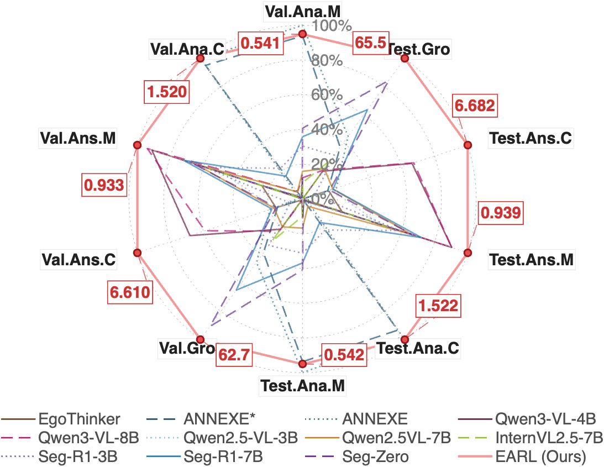
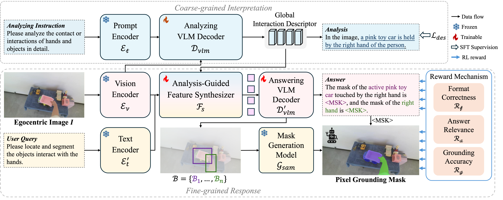
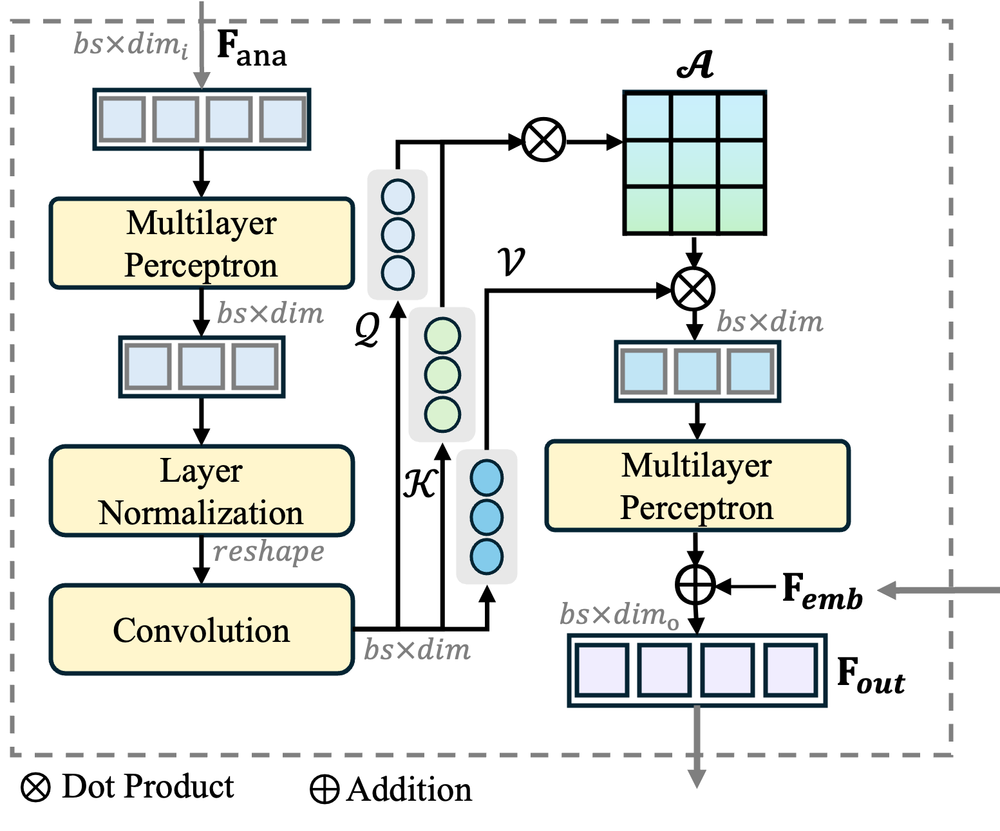
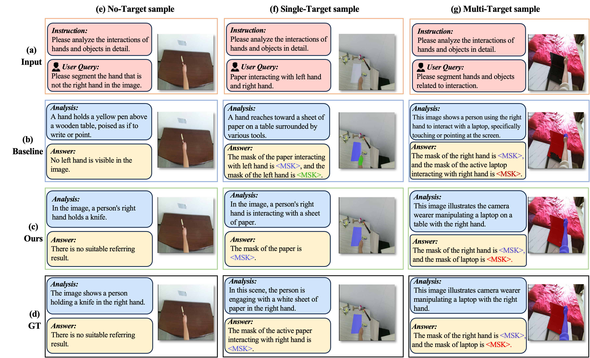

# EARL: Egocentric Analysis-guided Reinforcement Learning

[](https://arxiv.org/abs/2605.14742)
[](https://icml.cc/)
[](https://github.com/yuggiehk/EARL)

> **EARL: Towards a Unified Analysis-Guided Reinforcement Learning Framework for Egocentric Interaction Reasoning and Pixel Grounding**
>
> Yuejiao Su, Xinshen Zhang, Zhen Ye, Lei Yao, Lap-Pui Chau, Yi Wang
>
> *International Conference on Machine Learning (ICML), 2026*

<p align="center">
  
</p>

## 🔥 News

- **[2026.05]** EARL is accepted at **ICML 2026**!
- **[2026.05]** Paper released on [arXiv](https://arxiv.org/abs/2605.14742).

## 📋 Overview

EARL is a **two-stage framework** for comprehensive egocentric interaction understanding, integrating reinforcement learning (GRPO) with multimodal large language models (MLLMs).

### Key Results on Ego-IRGBench

| Metric | Analysis (CIDEr) | Answering (CIDEr) | Grounding (cIoU) |
|--------|:---:|:---:|:---:|
| **EARL (Ours)** | **1.522** | **6.682** | **65.48%** |
| Previous SOTA | 1.494 | 2.656 | 57.11% |
| Improvement | +0.028 | +4.026 | **+8.37%** |

### Framework

EARL adopts a **coarse-to-fine** design:

1. **Coarse-grained Interpretation** — Generates holistic textual descriptions of egocentric interactions using Qwen2.5-VL-3B.
2. **Fine-grained Response** — Produces textual answers and pixel-level grounding masks via Qwen2.5-VL-7B + SAM2, optimized with GRPO.

<p align="center">
  
</p>

To bridge the two stages, we introduce the **Analysis-guided Feature Synthesizer (AFS)**, which extracts a *global interaction descriptor* from the interpretation stage and injects it as a semantic prior into the response stage.

<p align="center">
  
</p>


## 🏗️ Project Structure

```
earl/
├── scripts/
│   ├── train/              # Training launch scripts
│   ├── infer/
│   │   └── inference.py    # Unified inference (supports CLI args)
│   └── eval/               # Evaluation utilities
├── src/open_r1/            # Core source code
│   ├── grpo_jsonl.py       # ⭐ Main EARL GRPO training entry point
│   ├── grpo_rec.py         # Referring Expression Comprehension GRPO
│   ├── grpo.py             # Math GRPO training (baseline)
│   ├── sft.py              # Supervised fine-tuning
│   ├── qwen2_5vl_monkey_patch.py  # Qwen2.5-VL patches (FlashAttn fix + goal embedding injection)
│   ├── trainer/
│   │   ├── grpo_trainer.py # VLMGRPOTrainer (GRPO for vision-language models)
│   │   └── grpo_config.py  # GRPO hyperparameter configuration
│   ├── vlm_modules/
│   │   ├── qwen_module.py  # Qwen2-VL/2.5-VL module + FusionModule (AFS)
│   │   ├── internvl_module.py  # InternVL module
│   │   └── vlm_module.py   # VLM base class
│   └── utils/              # Callbacks, evaluation, hub utilities
├── tools/                  # Auxiliary tools
├── deprecated/             # Earlier (deprecated) versions for reference
├── outputs/                # Output data & training logs
├── run_scripts/            # Shell scripts for launching training jobs
└── assets/                 # Paper figures
```

## 🚀 Installation

```bash
# Clone the repository
git clone https://github.com/yuggiehk/EARL.git
cd EARL

# Install dependencies
pip install -r requirements.txt

# Install the open_r1 package in editable mode
cd src/open-r1-multimodal
pip install -e .

# (Optional) Install SAM2 for grounding evaluation
# cd ../.. && git clone https://github.com/facebookresearch/sam2.git
# cd sam2 && pip install -e .
```

## 🏃 Quick Start

### Training (GRPO with EARL rewards)

```bash
cd src/open-r1-multimodal
bash run_scripts/run_grpo_jsonl.sh
```

Key arguments:
- `--goal_embedding_path`: Path to pre-computed caption embeddings (`.npz`)
- `--reward_funcs`: `["ego_answer", "ego_grounding", "format"]`
- `--data_file_paths`: JSONL data files (colon-separated)
- `--image_folders`: Image root directories (colon-separated)

### Inference

```bash
python scripts/infer/inference.py \
    --base_model /path/to/Qwen2.5-VL-7B-Instruct \
    --lora_adapter /path/to/checkpoint-1000 \
    --test_data /path/to/ego_irgbench_test.jsonl \
    --output results.json \
    --max_new_tokens 88
```

### Evaluation

```bash
# Text-only evaluation (CIDEr + METEOR on <answer> content)
python tools/cider_check.py results.json

# Full pipeline evaluation (text + SAM2 grounding IoU)
# See scripts/eval/ for evaluation scripts
```

## 🧠 Core Components

### Analysis-guided Feature Synthesizer (AFS)

The AFS (`FusionModule` in `vlm_modules/qwen_module.py`) bridges the interpretation and response stages:

```
goal_caption_embedding [B, 2048]
    → Linear(2048→1024) → LayerNorm → Conv2d Self-Attention
    → Linear(1024→3584) → Residual: out × 0.1 + text_pooled_embedding
    → Injected into text tokens during LLM forward pass
```

### Multi-faceted Reward Design

| Reward | Description | Implementation |
|--------|-------------|---------------|
| ℛ<sub>f</sub> — Format | Valid `<answer>` + `<bbox>` XML structure | `format_reward()` in `grpo_jsonl.py` |
| ℛ<sub>a</sub> — Answer | Entity matching (ExactMatch + Levenshtein) | `ego_answer_rewards()` in `grpo_jsonl.py` |
| ℛ<sub>g</sub> — Grounding | SAM2 mask IoU with ground truth | `ego_grounding_rewards()` in `grpo_jsonl.py` |

### GRPO Training Stabilization

We adopt an **asymmetric clipped ratio** from DAPO: ε<sub>low</sub> ≪ ε<sub>high</sub>, preventing excessive policy suppression while encouraging exploration.

## 📊 Results

<p align="center">
  
</p>

### In-Domain (Ego-IRGBench)

EARL achieves **65.48% cIoU** for pixel grounding, outperforming previous RL-based methods by **8.37%**. Full comparison in Table 1 of the [paper](https://arxiv.org/abs/2605.14742).

### Out-of-Distribution (EgoHOS)

EARL achieves **38.21% overall cIoU** on EgoHOS, demonstrating strong transferability to unseen egocentric scenarios (Table 2).

### Ablation Studies

| Training | Fusion | Answer CIDEr | Grounding cIoU |
|----------|--------|:---:|:---:|
| SFT | — | 2.339 | 32.47% |
| SFT | AFS | 4.313 | 43.85% |
| RL | — | 2.703 | 39.81% |
| RL | CAF | 5.241 | 52.36% |
| **RL** | **AFS** | **6.682** | **65.48%** |

## 📝 Citation

```bibtex
@inproceedings{su2026earl,
    title     = {EARL: Towards a Unified Analysis-Guided Reinforcement Learning
                 Framework for Egocentric Interaction Reasoning and Pixel Grounding},
    author    = {Su, Yuejiao and Zhang, Xinshen and Ye, Zhen and Yao, Lei and
                 Chau, Lap-Pui and Wang, Yi},
    booktitle = {International Conference on Machine Learning (ICML)},
    year      = {2026},
}
```

## 📄 License

This project is released under the Apache 2.0 License. See [LICENSE](LICENSE) for details.

## 🙏 Acknowledgements

This project builds upon [open-r1-multimodal](https://github.com/huggingface/open-r1) by Hugging Face. We thank the authors of Qwen2.5-VL, SAM2, and TRL for their open-source contributions.
